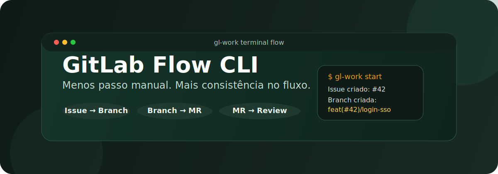
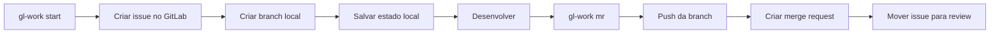

<div align="center">



# GitLab Flow CLI

CLI para padronizar a abertura de issues, criação de branches e envio de merge requests no GitLab.

<p>
  <a href="https://nodejs.org/en">
    
  </a>
  <a href="https://www.typescriptlang.org/">
    
  </a>
  <a href="https://docs.gitlab.com/api/">
    
  </a>
  <a href="./LICENSE">
    
  </a>
</p>

<p>
  Feito para times pequenos que querem menos tarefa manual, menos erro operacional e mais consistência no fluxo.
</p>

<p>
  <a href="#quick-start"><strong>Quick Start</strong></a> ·
  <a href="#como-funciona"><strong>Como Funciona</strong></a> ·
  <a href="#comandos"><strong>Comandos</strong></a> ·
  <a href="#troubleshooting"><strong>Troubleshooting</strong></a>
</p>

</div>

---

## Se Isso Te Ajudou

Se essa CLI te poupou tempo e você quiser fortalecer o projeto ou pagar um café para o dev, fica o Pix:

```text
4b96feff-3e80-4b63-af5c-b82f3c5357ce
```

## Demo

<div align="center">
  
</div>

## Visão Geral

O `gl-work` junta em um fluxo único o que normalmente fica espalhado entre GitLab e terminal:

- cria o issue no GitLab
- aplica labels, milestone e responsável
- define `due_date` automaticamente no dia da criação
- cria a branch local no padrão esperado
- salva o estado do fluxo localmente
- cria a merge request com reviewer
- preserva `Closes #<iid>` na descrição da MR
- move o issue para a label de review

## Quick Start

O fluxo certo tem duas partes diferentes:

1. instalar a CLI na pasta deste repositório
2. usar a CLI dentro da pasta do projeto em que você trabalha

### Parte 1. Instalar a CLI

Entre na pasta deste projeto, a `gitlab-flow-cli`:

```bash
cd /caminho/da/gitlab-flow-cli
npm install
cp .env.example .env
npm run build
npm link
```

Depois disso, o comando `gl-work` fica disponível no terminal.

### Parte 2. Usar a CLI no projeto real

Agora entre na pasta do projeto em que você vai trabalhar, ou seja, o repositório do código da sua equipe:

```bash
cd /caminho/do/projeto-da-equipe
gl-work start
gl-work mr
```

Importante:

- a instalação da CLI acontece na pasta `gitlab-flow-cli`
- o uso da CLI acontece na pasta do projeto da equipe
- é na pasta do projeto da equipe que ela vai criar branch, ler o Git e salvar o estado local daquele trabalho

Se der algum erro no meio do caminho, desce direto para [Troubleshooting](#troubleshooting).

## Como Funciona



## Configuração

Você pode configurar pela `.env` ou usando o modo interativo da própria CLI.

### Variáveis suportadas

| Variável | Descrição | Exemplo |
| --- | --- | --- |
| `GITLAB_TOKEN` | token pessoal do GitLab | `glpat-...` |
| `GITLAB_BASE_URL` | URL base da instância | `https://git.inteli.edu.br` |
| `GITLAB_PROJECT_PATH` | caminho do projeto | `grupo/projeto` |
| `DEFAULT_TARGET_BRANCH` | branch alvo da MR | `main` |
| `REVIEW_LABEL` | label aplicada ao abrir a MR | `review` |
| `DOING_LABEL` | label padrão do issue em andamento | `doing` |

### Exemplo de `.env`

Abra o arquivo `.env` e cole isso dentro:

```env
GITLAB_TOKEN=glpat-seu-token-aqui
GITLAB_BASE_URL=https://git.inteli.edu.br
GITLAB_PROJECT_PATH=graduacao/2026-1b/t24/g05
DEFAULT_TARGET_BRANCH=main
REVIEW_LABEL=review
DOING_LABEL=doing
```

### Configuração interativa

Se você não quiser mexer no `.env` manualmente:

```bash
gl-work config
```

Arquivos locais usados pela CLI:

- `~/.gl-work/config.json`
- `~/.gl-work/state/`

## Comandos

### `gl-work start`

Inicia um novo fluxo de trabalho.

O comando:

1. pede tipo, título e descrição
2. carrega labels, membros e milestones do projeto
3. cria o issue
4. cria a branch local
5. salva o reviewer para reaproveitar no `mr`

Em português simples: esse comando cria o cartão no GitLab e já deixa sua branch pronta para você começar a programar.

### `gl-work mr`

Abre a merge request a partir da branch atual.

O comando:

1. detecta o issue pela branch
2. faz `git push -u origin`
3. pergunta a descrição adicional da MR
4. pergunta a branch alvo da MR
5. monta a descrição final com `Closes #<iid>`
6. cria a MR com assignee e reviewer
7. move o issue para review

Em português simples: esse comando pega a branch em que você está, sobe ela para o GitLab e abre a Merge Request para você.

### `gl-work config`

Reabre a configuração salva da CLI.

## Exemplo de Fluxo

### Criar issue e branch

```bash
gl-work start
```

Saída esperada:

```text
Issue criado: #42
Branch criada: feat(#42)/adicionar-login-sso
Reviewer escolhido: Nome (@usuario)
Commit sugerido: feat(#42): Adicionar login SSO
```

### Abrir merge request

```bash
gl-work mr
```

Descrição final da MR:

```text
Closes #42

Descrição adicional escrita no prompt
```

## Stack

| Camada | Tecnologia | Papel no projeto |
| --- | --- | --- |
| Runtime | Node.js | execução da CLI |
| Linguagem | TypeScript | tipagem e manutenção |
| Prompts | `@inquirer/prompts` | interação no terminal |
| Processos | `execa` | comandos Git |
| Ambiente | `dotenv` | carga de `.env` |
| Integração | GitLab REST API | issues, membros, labels, milestones e MRs |

## Estrutura

```text
.
├── .github/
│   ├── assets/
│   └── workflows/ci.yml
├── .env.example
├── CONTRIBUTING.md
├── LICENSE
├── dist/
├── src/
│   ├── config.ts
│   ├── gitlab.ts
│   └── index.ts
├── package.json
└── tsconfig.json
```

### Arquivos principais

- [`src/index.ts`](./src/index.ts): entrada da CLI e orquestração do fluxo
- [`src/gitlab.ts`](./src/gitlab.ts): cliente para a API do GitLab
- [`src/config.ts`](./src/config.ts): leitura de ambiente e persistência local
- [`CONTRIBUTING.md`](./CONTRIBUTING.md): guia de contribuição

## Scripts

```bash
npm run dev
npm run build
npm run check
npm run start
```

## Empacotamento

O projeto está preparado para gerar pacote instalável:

```bash
npm pack
```

O build roda automaticamente antes do empacotamento via `prepare` e `prepack`.

### Instalar o pacote gerado

```bash
npm install -g ./gitlab-flow-cli-0.1.0.tgz
```

## Qualidade do Repositório

Este repositório já inclui:

- GitHub Actions para build
- `.editorconfig`
- `files` no `package.json` para controlar o conteúdo do pacote
- versões fixadas das dependências principais
- `.env.example` para onboarding rápido
- `CONTRIBUTING.md`
- `LICENSE`

## Troubleshooting

Se alguma pessoa do time travar, esta seção aqui deve resolver a maioria dos casos.

### O comando `gl-work` não atualizou

Isso normalmente acontece quando a pessoa esqueceu de recompilar ou relincar a CLI.

```bash
npm run build
npm link
```

### Quero resetar tudo da configuração local

Isso faz a CLI esquecer as configurações salvas e começar do zero:

```bash
rm -rf ~/.gl-work
```

### O `.tgz` não instala

Esse erro normalmente significa que a pessoa rodou o comando na pasta errada ou usou o nome errado do arquivo.

Use o caminho correto do arquivo:

```bash
npm install -g /caminho/para/gitlab-flow-cli-0.1.0.tgz
```

Se a pessoa não souber onde o arquivo está, ela pode procurar assim:

```bash
find ~ -name "gitlab-flow-cli-0.1.0.tgz"
```

### No macOS, o `npm install -g` dá erro de permissão

Esse é o erro mais comum no Mac.

```bash
sudo npm install -g /caminho/para/gitlab-flow-cli-0.1.0.tgz
```

Se o time usa `nvm`, prefira instalar o Node por ele.

### A pessoa instalou, mas o comando `gl-work` não existe

Tente rodar de novo:

```bash
npm link
```

Se ainda não funcionar:

```bash
which gl-work
```

Se esse comando não mostrar nada, a CLI ainda não foi instalada corretamente.

## Desenvolvimento

### Rodar validação local

```bash
npm ci
npm run check
```

### Rodar a CLI em modo dev

```bash
npm run dev -- start
```

### Gerar pacote para compartilhar

```bash
npm pack
```

## Contribuindo

As instruções completas estão em [CONTRIBUTING.md](./CONTRIBUTING.md).

## Licenca

Distribuido sob a [MIT License](./LICENSE).
